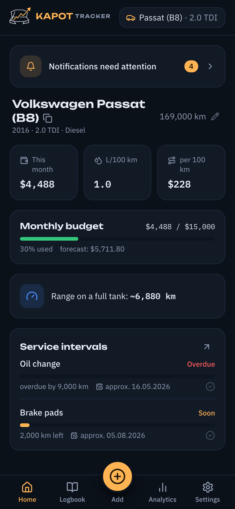
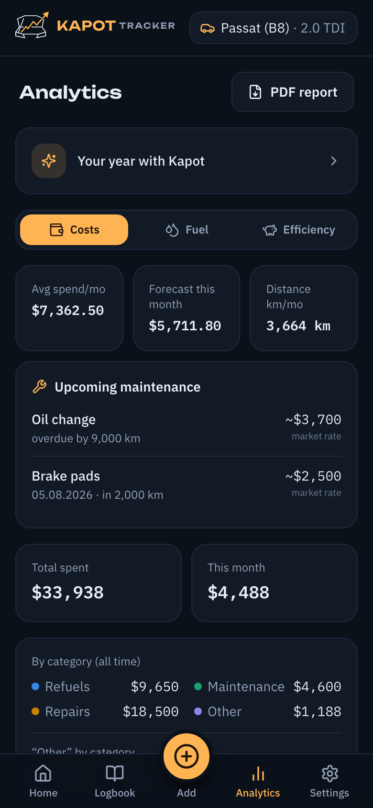
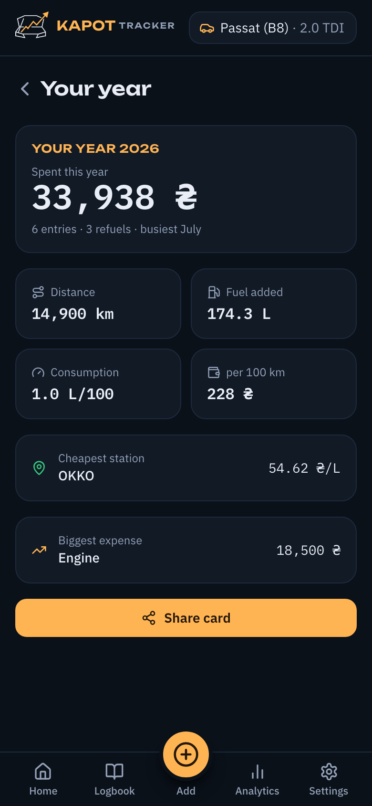
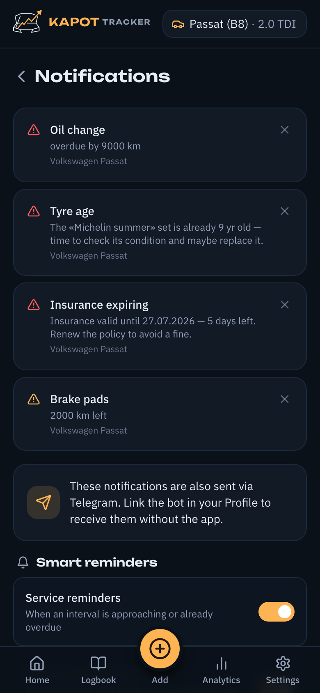
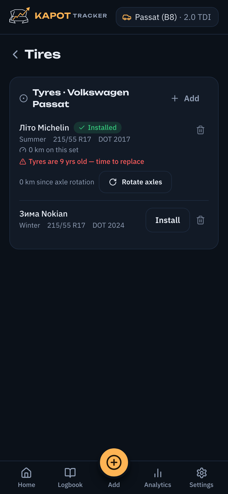
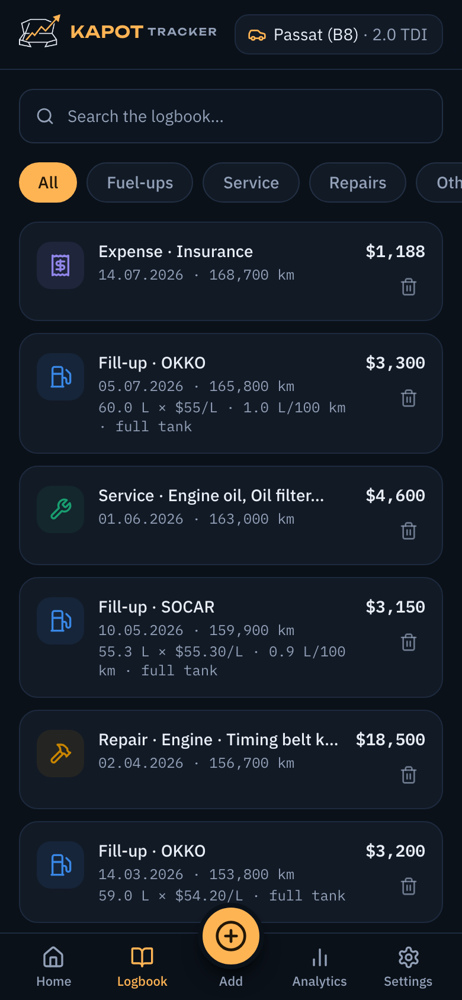

<p align="center">
  
</p>

<p align="center"><b>English</b> · <a href="README.uk.md">Українська</a></p>

<p align="center">
A car logbook and expense tracker built for drivers — fuel, service, repairs and
documents in one place, with photo OCR, smart reminders and a Telegram bot.<br>
Mobile-first PWA, Ukrainian and English.
</p>

<p align="center">
<b>Live app:</b> <a href="https://kapot-tracker.vercel.app">kapot-tracker.vercel.app</a> ·
<b>API:</b> <a href="https://kapot-tracker.duckdns.org">kapot-tracker.duckdns.org</a>
</p>

---

## Screenshots

<p align="center">
  
  
  
</p>
<p align="center">
  
  
  
</p>

<p align="center"><i>Dashboard · analytics · year in review · notification centre · tyres · logbook</i></p>

---

## What it does

### Logbook & entry
- Multiple cars per account; four entry types — **refuel, service (ТО), repair, expense**.
- **Full-to-full fuel consumption** (l/100 km) computed from the refuel history.
- Photo attachments per entry (receipts, work orders) — gallery + lightbox, up to 10 MB.
- Edit, **duplicate** («repeat last»), delete, full-text search combined with type filters.
- **Offline entry**: saved locally and synced when the connection is back.

### Photo OCR & AI (Google Gemini)
- Scan a **fuel receipt**, an **СТО work order** or **any expense receipt** — the photo
  auto-fills the form. Vision-first (Gemini reads angled phone photos from **any country
  in any language** and returns the fields in **your** language), with local tesseract /
  OCR.space as the no-key fallback. Web scan and the bot share the same vision path.
- Graceful degradation: when the model is rate-limited the app says **«scan unavailable,
  enter manually»** instead of blaming the photo.
- **Free-text logging in the Telegram bot** — «залив 40 л на окко за 2200» / «filled 40 L
  at Shell for 60»: the model classifies the message and fills the right entry.

### Analytics & insights
- Spend **by category and by month**, spending **forecast**, total cost of ownership (**cost/km**).
- Fuel consumption trend, fuel-**price history**, per-station stats and the **cheapest station**.
- **Monthly budget** with pacing and projection; a **consumption-spike** watchdog
  («+18 % over your baseline — check tyre pressure»).
- **«Your year with Kapot»** — a Spotify-Wrapped-style annual recap with a shareable image.
- **PDF service-history report** and **CSV** export of the logbook.

### Reminders & the notification centre
- **Service intervals** (by distance and/or time) with a predicted due date and a one-tap
  «Done» that logs the service and moves the clock forward.
- **Tyres**: seasonal changeover (region inferred from the plate), axle-rotation every
  ~10 000 km, and **tyre-age** («these are 9 years old — inspect or replace»).
- **Document / ОСЦПВ expiry** reminders, escalating in the last week.
- An **in-app notification centre** (nothing stored — computed on read), a Dashboard
  banner, an **app-icon badge**, and **Telegram push** with a weekly digest.

### Records
- **Documents** with expiry tracking (insurance, technical inspection…).
- A public **QR car passport** for service/parking, and a **tyres** module.
- **OBD** diagnostics from a Car Scanner CSV, and a per-car **spec cheat-sheet**.

### Sharing, data & accounts
- **Multi-driver sharing** per car (owner / editor / viewer) with invite links and
  per-author attribution on every entry.
- Full **JSON backup & restore** (identity, config, specs, tyres, logs) and CSV export.
- JWT auth (access + refresh, token-version revocation), **password reset via Telegram**,
  rate limiting, and full **account deletion**.
- Alembic migrations applied automatically on startup.

### Platform
- **PWA** — installable, works offline, icon badge.
- **Localized** — **English by default** with a one-tap **Ukrainian** toggle on every screen
  (auth screens and Settings). The language follows the account across the **UI, emails,
  Telegram bot and API errors**.
- **Display currency** — pick from **10 currencies** (USD by default, ₴ second); every amount
  shows your symbol in the app, PDF report and bot. Amounts are stored as entered — **the
  symbol changes, values are never converted**.
- **Telegram bot** — quick logging, reminders, weekly digest, on-demand backup.

---

## Architecture

```
frontend (React PWA, Vercel / nginx)  ──/api──►  backend (FastAPI)  ──►  PostgreSQL / SQLite
                                                       ▲
                                        Telegram bot (aiogram, same image)
```

- **Backend** — FastAPI (Python 3.12), REST + JWT. SQLite for local dev, PostgreSQL in
  Docker/production (SQLAlchemy). Alembic migrations run on startup.
- **Frontend** — React + Vite + Tailwind, shipped as an installable PWA (vite-plugin-pwa).
- **Bot** — aiogram v3, runs as a second process from the same backend image.
- **OCR** — Google Gemini vision (optional key), tesseract + OCR.space as the free fallback.
- **Hosting** — frontend on Vercel; backend on an Oracle Cloud Always-Free VM behind Caddy,
  with DuckDNS for DNS. Runs comfortably free at small scale.

### Repository layout

```
backend/
  app/
    routers/     # HTTP endpoints (auth, cars, logs, analytics, tires, notifications, ocr, …)
    services/    # domain logic (stats, forecast, fuel, ocr, climate, notifications, year_review, …)
    bot/         # aiogram handlers, reminders, free-text AI intent
    models.py    # SQLAlchemy models
    schemas.py   # Pydantic schemas
  alembic/       # database migrations
frontend/
  src/
    views/       # pages (Dashboard, Logbook, Analytics, Tires, YearReview, Notifications, …)
    components/  # shared UI
    api/         # thin API client per resource
    i18n/        # uk / en locales
docs/            # DEPLOY.md and design notes
```

---

## Running it

Requires Docker + Docker Compose.

```bash
cp .env.example .env                     # then edit — set at least SECRET_KEY
docker compose up -d --build             # db + backend + frontend
docker compose --profile bot up -d       # (optional) the Telegram bot
```

- Frontend: http://localhost (nginx) · API: http://localhost:8000
- Local dev without Docker: `uvicorn app.main:app --reload` (backend) and `npm run dev` (frontend).

### Key configuration (`.env`)

| Variable | Purpose |
|---|---|
| `SECRET_KEY` | JWT signing — **must** be a strong random value |
| `DATABASE_URL` | `sqlite:///./kapot_tracker.db` (dev) or `postgresql+psycopg2://…` |
| `PUBLIC_URL` | Public frontend origin (magic links, QR passport, bot CTA) |
| `CORS_ORIGINS` | Comma-separated allowed origins |
| `GEMINI_API_KEY` / `GEMINI_MODEL` | Vision OCR + free-text bot parsing (optional) |
| `TELEGRAM_BOT_TOKEN` / `TELEGRAM_BOT_USERNAME` | The Telegram bot (optional) |
| `BAZA_GAI_API_KEY` | Ukrainian plate/VIN lookup (optional) |
| `SMTP_*` | Email verification & password reset (required when `ENV=production`) |
| `UPLOADS_DIR` / `BACKUP_DIR` / `BACKUP_KEEP` | Photo storage and DB backups |

Everything optional degrades gracefully: no Gemini key → free OCR rungs; no bot token →
no Telegram; no SMTP in dev → registration auto-verifies.

Full production setup (Oracle Cloud + DuckDNS + Caddy, free): **[docs/DEPLOY.md](docs/DEPLOY.md)**.

---

## Status

A personal project, hosted for anyone who wants to use it at the live link above. Built
Ukrainian-first for local realities (ОСЦПВ, ГБО, seasonal tyres, regional fuel prices).

---

## License

Source-available under the [PolyForm Noncommercial License 1.0.0](LICENSE). You are welcome
to read the code, learn from it, and run it for personal, educational or other noncommercial
use. Running it as a commercial or hosted service is not permitted — Kapot Tracker is offered
as a hosted product at the link above.
